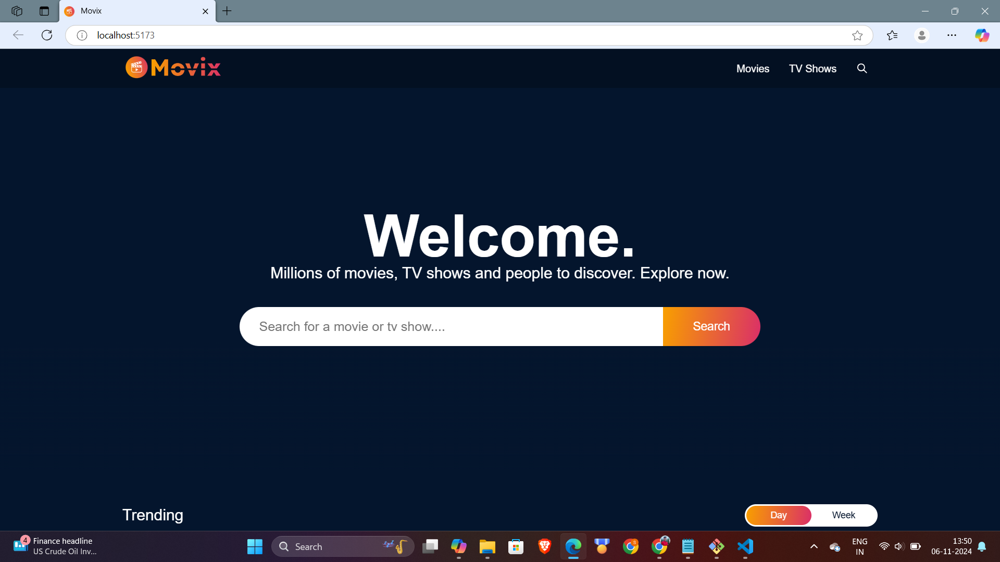
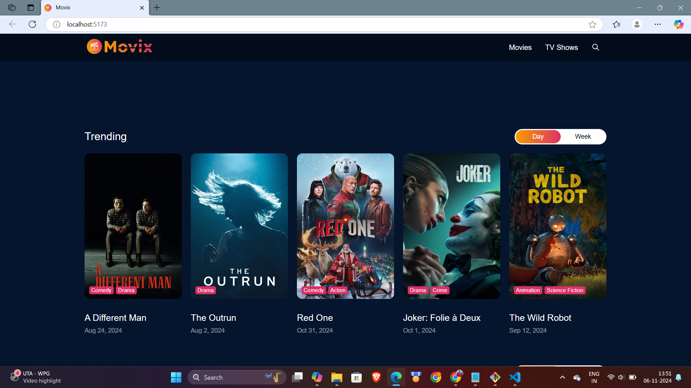

# OTT Platform in React

## Project Overview

This project is an OTT (Over-the-Top) platform developed with React. The platform allows users to browse and stream media content, featuring a modern, responsive interface optimized for various devices. The project is built with Vite for efficient development and bundling.

## Features

- **Media Browsing**: View media items such as movies and series.
- **Responsive Design**: Optimized for both desktop and mobile views.
- **Dynamic Routing**: Uses React Router for seamless navigation.
- **Customizable UI**: Easily configurable and extendable components.

## Media Gallery
<p align="center">
  
  
  
  
</p>


## Tech Stack

- **Frontend**: React, JavaScript, CSS, SCSS
- **Build Tool**: Vite
- **Package Manager**: npm
- **Deployment Config**: `vercel.json` included for Vercel deployment

## Project Structure

- **`public/`**: Static files (logos, favicon, etc.)
- **`src/`**: Source code, including:
  - **`App.jsx`**: Main React component that initializes the app.
  - **`index.css` / `index.scss`**: Main stylesheets.
  - **`assets/`**: Images and icons used across the app.
- **`package.json`**: Lists project dependencies and npm scripts.
- **`vite.config.js`**: Configurations for Vite.

## Installation

1. **Clone the Repository**:
   ```bash
   git clone <repository-url>
   cd OTT-PLATFORM-IN-REACT
   ```

2. **Install Dependencies**:
   ```bash
   npm install
   ```

3. **Set Up Environment Variables**:
   - Rename `.env.example` to `.env` (if included) and provide necessary keys, like API keys for media data.

4. **Run the Development Server**:
   ```bash
   npm run dev
   ```

## Available Scripts

- **`npm run dev`**: Runs the app in development mode.
- **`npm run build`**: Builds the app for production.
- **`npm run preview`**: Serves the production build locally.

## Deployment

This project is configured for deployment with Vercel, with configuration available in `vercel.json`. For deployment:

1. Ensure environment variables are configured in Vercel.
2. Deploy by connecting the repository to Vercel.

## Contributing

1. Fork the repository.
2. Create a new branch (`feature/YourFeature`).
3. Commit your changes and push the branch.
4. Open a pull request.

## License

This project is open-source and available under the [MIT License](LICENSE).
